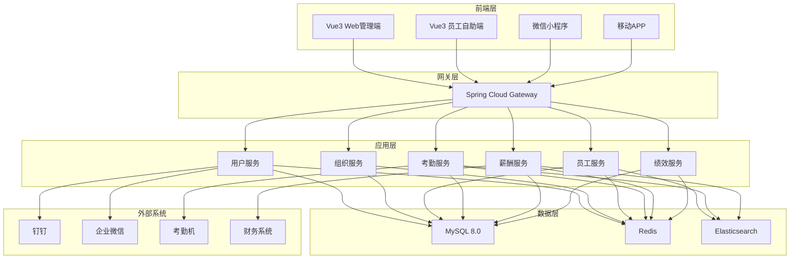
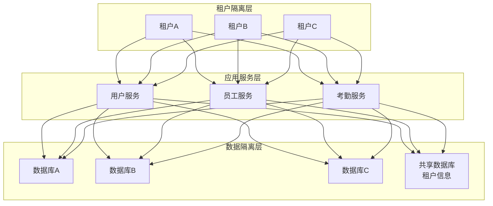
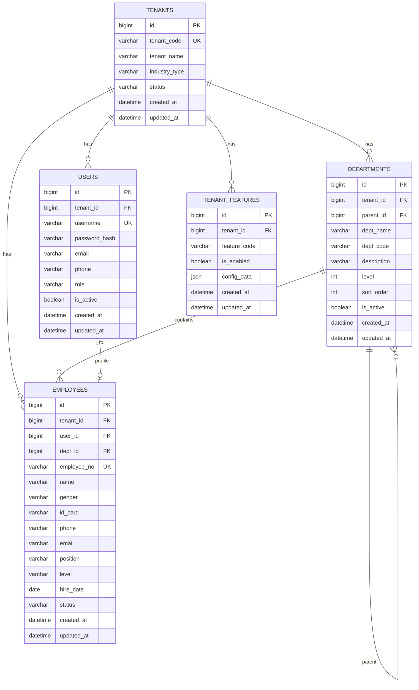

# 🏗️ 人事SaaS系统架构图

## 系统整体架构

```mermaid
graph TB
    subgraph "前端层"
        A[Vue3 Web管理端]
        B[Vue3 员工自助端]
        C[微信小程序]
        D[移动APP]
    end
    
    subgraph "网关层"
        E[Spring Cloud Gateway]
    end
    
    subgraph "应用层"
        F[用户服务]
        G[组织服务]
        H[员工服务]
        I[考勤服务]
        J[薪酬服务]
        K[绩效服务]
    end
    
    subgraph "数据层"
        L[MySQL 8.0]
        M[Redis]
        N[Elasticsearch]
    end
    
    subgraph "外部系统"
        O[钉钉]
        P[企业微信]
        Q[考勤机]
        R[财务系统]
    end
    
    A --> E
    B --> E
    C --> E
    D --> E
    
    E --> F
    E --> G
    E --> H
    E --> I
    E --> J
    E --> K
    
    F --> L
    G --> L
    H --> L
    I --> L
    J --> L
    K --> L
    
    F --> M
    G --> M
    H --> M
    I --> M
    J --> M
    K --> M
    
    H --> N
    I --> N
    J --> N
    
    F --> O
    F --> P
    I --> Q
    J --> R
```

## 多租户架构设计

```mermaid
graph TB
    subgraph "租户隔离层"
        A[租户A]
        B[租户B]
        C[租户C]
    end
    
    subgraph "应用服务层"
        D[用户服务]
        E[员工服务]
        F[考勤服务]
    end
    
    subgraph "数据隔离层"
        G[数据库A]
        H[数据库B]
        I[数据库C]
        J[共享数据库<br/>租户信息]
    end
    
    A --> D
    B --> D
    C --> D
    
    A --> E
    B --> E
    C --> E
    
    A --> F
    B --> F
    C --> F
    
    D --> G
    D --> H
    D --> I
    D --> J
    
    E --> G
    E --> H
    E --> I
    E --> J
    
    F --> G
    F --> H
    F --> I
    F --> J
```

## 核心数据库ER图

```mermaid
erDiagram
    TENANTS {
        bigint id PK
        varchar tenant_code UK
        varchar tenant_name
        varchar industry_type
        varchar status
        datetime created_at
        datetime updated_at
    }
    
    USERS {
        bigint id PK
        bigint tenant_id FK
        varchar username UK
        varchar password_hash
        varchar email
        varchar phone
        varchar role
        boolean is_active
        datetime created_at
        datetime updated_at
    }
    
    DEPARTMENTS {
        bigint id PK
        bigint tenant_id FK
        bigint parent_id FK
        varchar dept_name
        varchar dept_code
        varchar description
        int level
        int sort_order
        boolean is_active
        datetime created_at
        datetime updated_at
    }
    
    EMPLOYEES {
        bigint id PK
        bigint tenant_id FK
        bigint user_id FK
        bigint dept_id FK
        varchar employee_no UK
        varchar name
        varchar gender
        varchar id_card
        varchar phone
        varchar email
        varchar position
        varchar level
        date hire_date
        varchar status
        datetime created_at
        datetime updated_at
    }
    
    TENANT_FEATURES {
        bigint id PK
        bigint tenant_id FK
        varchar feature_code
        boolean is_enabled
        json config_data
        datetime created_at
        datetime updated_at
    }
    
    TENANTS ||--o{ USERS : "has"
    TENANTS ||--o{ DEPARTMENTS : "has"
    TENANTS ||--o{ EMPLOYEES : "has"
    TENANTS ||--o{ TENANT_FEATURES : "has"
    DEPARTMENTS ||--o{ DEPARTMENTS : "parent"
    DEPARTMENTS ||--o{ EMPLOYEES : "contains"
    USERS ||--o| EMPLOYEES : "profile"
```

## 技术栈架构

```mermaid
graph TB
    subgraph "前端技术栈"
        A1[Vue 3]
        A2[TypeScript]
        A3[Element Plus]
        A4[Pinia]
        A5[Vite]
    end
    
    subgraph "后端技术栈"
        B1[Spring Boot 3.x]
        B2[Spring Security]
        B3[Spring Data JPA]
        B4[MyBatis Plus]
        B5[Redis]
    end
    
    subgraph "数据库技术栈"
        C1[MySQL 8.0]
        C2[Redis]
        C3[Elasticsearch]
    end
    
    subgraph "部署技术栈"
        D1[Docker]
        D2[Docker Compose]
        D3[Nginx]
        D4[GitHub Actions]
    end
    
    A1 --> A2
    A2 --> A3
    A3 --> A4
    A4 --> A5
    
    B1 --> B2
    B2 --> B3
    B3 --> B4
    B4 --> B5
    
    C1 --> C2
    C2 --> C3
    
    D1 --> D2
    D2 --> D3
    D3 --> D4
```

---

*最后更新时间: 2024年12月19日*
*版本: v1.0*
